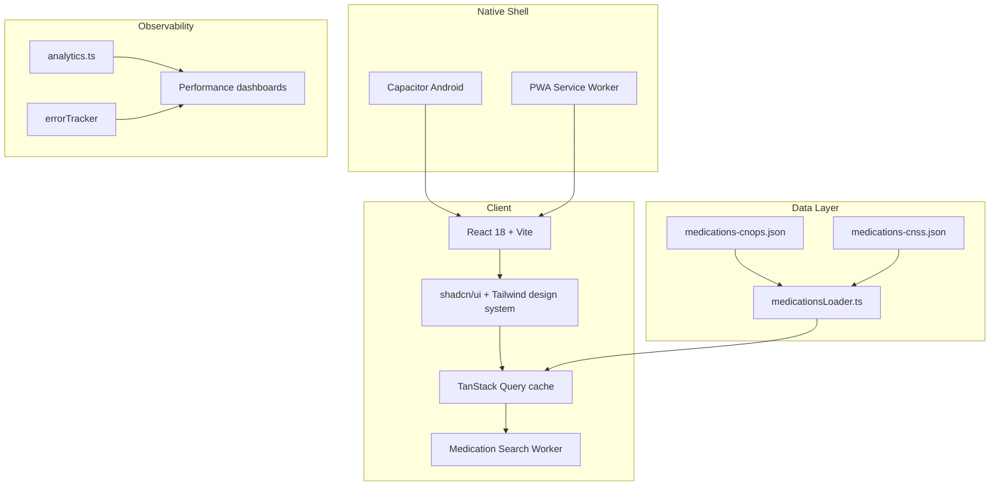

<div align="center">
  
  <h1>Taawidaty · تعويضاتي</h1>
  <p><strong>Morocco's medication reimbursement copilot for CNOPS & CNSS members</strong></p>
  
  <p>
    <a href="https://taawidaty.ma"></a>
    <a href="https://play.google.com/store/apps/details?id=com.taawidaty.app"></a>
    
    
    
  </p>

  <p><strong>5,709+ curated medications · bilingual 🇫🇷/🇲🇦 · 60fps UI · PWA ready</strong></p>
</div>

---

## Table of Contents

- [Product Snapshot](#product-snapshot)
- [Feature Highlights](#feature-highlights)
- [Architecture Overview](#architecture-overview)
- [Data Pipeline & Accuracy](#data-pipeline--accuracy)
- [Tech Stack](#tech-stack)
- [Project Structure](#project-structure)
- [Getting Started](#getting-started)
- [Quality & Testing](#quality--testing)
- [Deployment & Distribution](#deployment--distribution)
- [Roadmap](#roadmap)
- [Documentation Hub](#documentation-hub)
- [Contributing & Support](#contributing--support)

---

## Product Snapshot

Taawidaty (a.k.a. **DawaCalc**) is a bilingual web + mobile experience that calculates precise medication reimbursement for Morocco's CNOPS and CNSS systems. It combines an official, cleaned data set with a medical-grade UI to deliver instant, trustworthy answers.

### At a glance

| Metric | CNOPS | CNSS |
| --- | --- | --- |
| Medications in database | 5,709 | 5,709 |
| Reimbursement tiers | 0%, 70% | 0%, 70%, 90% |
| Average reimbursement | 240 MAD | 252 MAD |
| Languages | Arabic (RTL), French (LTR) | Arabic (RTL), French (LTR) |

### Why it matters

* **Moroccan-first UX**: RTL-friendly design systems, legal branding, and accessibility that meets WCAG 2.1 AA.
* **Trust through transparency**: Each result shows PPV, reimbursement base, patient contribution, and origin (Princeps vs Générique).
* **Mobile reach**: Capacitor build + Android Play Store release, offline caching, and install prompts.

---

## Feature Highlights

| Area | Why it matters | Key files |
| --- | --- | --- |
| Dual insurance engine | Switch between CNOPS & CNSS with provider-specific logic, logos, and coverages. | `src/pages/Index.tsx`, `src/components/ResultCard.tsx`, `src/data/medicationsLoader.ts` |
| Ultra-fast search | Web Worker powered fuzzy search and debounce for instant results on low-end phones. | `src/workers/medication.worker.ts`, `src/components/SearchInput.tsx` |
| Analytics & monitoring | Granular tracking of calculations, scroll depth, and performance budgets (LCP, CLS, FID). | `src/lib/analytics.ts`, `src/lib/performance.ts` |
| Accessibility toolkit | Focus traps, screen-reader announcers, ARIA helpers, and color-contrast utilities. | `src/lib/accessibility.ts`, `tailwind.config.ts` |
| Monetization ready | Five contextual ad slots + Google AdSense adapter with bilingual labelling. | `src/components/AdBanner.tsx`, `docs/MONETIZATION.md` |

> Dive deeper into animations, UX patterns, and mobile optimizations inside `docs/FEATURES.md`.

---

## Architecture Overview

Modern React + Vite SPA deployed as PWA + Android shell, backed by a static medication dataset processed via Python scripts.



Key principles:

1. **Static-first data** keeps the experience lightning fast and offline-friendly.
2. **Component driven UI** via shadcn/ui primitives ensures consistency and RTL resiliency.
3. **Edge-cached deployment** (Vercel/Netlify-ready) + Capacitor for stores.

---

## Data Pipeline & Accuracy

1. **Source ingestion** — Excel files from CNOPS/CNSS are processed by `process_medications.py` and `process_medications_cnss.py` to normalize fields (price, reimbursement rate, DCI, type).
2. **Validation** — `test_medications.mjs` checks schema integrity, coverage tiers, and duplicate IDs.
3. **Typing** — `.d.ts` files in `src/data` keep the UI strictly typed.
4. **Runtime loading** — `medicationsLoader.ts` lazily loads the correct dataset, caches it, and exposes helpers for search and analytics.
5. **Continuous updates** — Scripts in `/docs/SCRAPER*` describe how to refresh the data when official lists change.

Accuracy guardrails:

- Reimbursement amount is calculated as $(prix\_br \times taux\_remb) / 100$ and cross-checked with PPV to derive the patient contribution.
- Dual cache strategy prevents stale data when switching between CNOPS and CNSS.
- Lighthouse budgets enforce SEO > 90, Accessibility > 95, Performance > 90.

---

## Tech Stack

| Layer | Tools |
| --- | --- |
| UI | React 18, TypeScript, shadcn/ui, Tailwind CSS, Framer Motion |
| State & data | TanStack Query, Immer, Fuse.js, i18next |
| Platform | Vite 5, Capacitor 7 (Android), PWA (Workbox), ESLint 9 |
| Tooling | Bun / npm, TypeScript 5.8, Vitest/Testing Library, Sharp |
| Docs & ops | Mermaid, SEO toolkit, GDPR playbooks | 

---

## Project Structure

```bash
├── src
│   ├── components/        # UI primitives + feature components (AdBanner, ResultCard, SearchInput)
│   ├── data/              # CNOPS/CNSS JSON datasets, loaders, and typings
│   ├── hooks/             # Language, toast, and mobile helpers
│   ├── lib/               # Analytics, translations, utils, accessibility, performance
│   └── pages/             # Router pages (Index, FAQ, NotFound)
├── public/                # Logos, manifest, service worker assets
├── android/               # Capacitor Android shell
├── docs/                  # Deep-dive documentation (deployment, SEO, GDPR, scraping)
├── .env.example           # Config template
└── package.json           # Scripts & dependencies
```

---

## Getting Started

### Prerequisites

- Node.js 20+ (Bun 1.1+ optional for faster installs)
- npm 10+ or bun
- `git` for version control

### Local setup

```bash
# install dependencies
npm install   # or: bun install

# start dev server with hot reload
npm run dev

# create production build
npm run build

# preview production bundle locally
npm run preview
```

### Environment variables

1. Copy `.env.example` to `.env.local`.
2. Fill analytics keys (GA, Sentry), API URLs, and feature flags.
3. Never commit real secrets—use the template and deployment platform secrets.

---

## Quality & Testing

- **Linting**: `npm run lint` (ESLint 9 + TypeScript ESLint) keeps code consistent.
- **Dataset validation**: `node test_medications.mjs` ensures the JSON payloads stay trustworthy.
- **UI tests**: `@testing-library/react` covers mission-critical flows (examples in `src/components/__tests__`).
- **Performance budgets**: See `docs/FEATURES.md` for Lighthouse targets and monitoring utilities.

> Tip: run tests before shipping data updates to guarantee both CNOPS and CNSS loaders stay in sync.

---

## Deployment & Distribution

| Target | How |
| --- | --- |
| Web (Vite SPA) | Follow `docs/DEPLOYMENT.md` for Vercel/Netlify/Cloudflare recipes, including sitemap generation (`npm run generate:sitemap`). |
| Android | `npx cap sync android && cd android && ./gradlew assembleRelease`. Detailed steps live in `docs/DEPLOYMENT_GUIDE.md`. |
| PWA | Service worker + manifest already configured; just ensure HTTPS + proper caching headers. |

Additional references:

- `docs/SEO_GUIDE.md` + `docs/SEO_QUICK_START.md` for structured data, sitemaps, and canonical tags.
- `docs/GDPR_COMPLIANCE.md` for privacy posture, analytics opt-out, and consent tracking.

---

## Roadmap

- [ ] Public API for third-party integrations.
- [ ] Automated dataset refresh pipeline triggered by CNOPS bulletins.
- [ ] iOS (Capacitor) packaging and App Store rollout.
- [ ] Advanced filters (e.g., form, reimbursement threshold).

Progress is tracked in `IMPLEMENTATION_STATUS.md`. Contributions toward roadmap items are welcome—just open an issue first.

---

## Documentation Hub

| Topic | Location |
| --- | --- |
| Documentation index | `docs/README.md` |
| Full project history & architecture | `docs/PROJECT_DOCUMENTATION.md` |
| Feature playbook & performance tips | `docs/FEATURES.md` |
| Monetization strategy | `docs/MONETIZATION.md` |
| Scraper & data hygiene | `docs/SCRAPER_README.md`, `docs/SCRAPING_SUMMARY.md` |
| Regulatory & compliance | `docs/GDPR_COMPLIANCE.md`, `docs/MOROCCAN_UX_AUDIT.md` |

---

## Contributing & Support

1. Fork the repo and create a feature branch.
2. Ensure lint + dataset tests pass.
3. Describe the change in your PR with before/after context and screenshots for UI updates.

Need help or want to collaborate? Open an issue or reach out to [@salma1-create](https://github.com/salma1-create).

---

<div align="center">
  <strong>Taawidaty — accurate reimbursements, trusted by Moroccan families.</strong>
</div>
